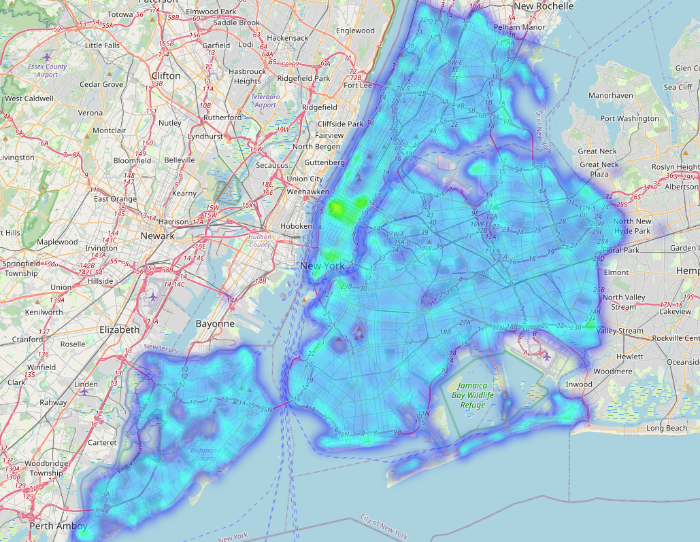
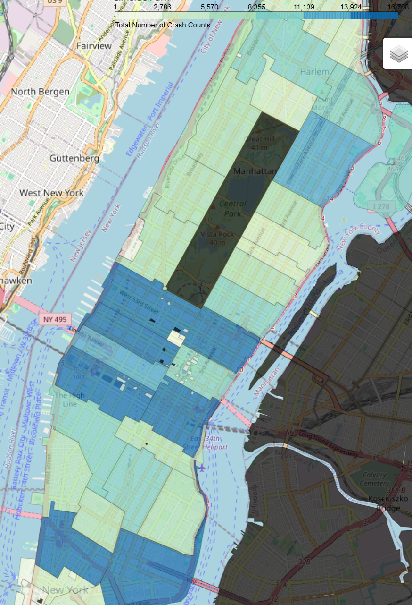

# 🚦 Explorer Transportation Data Science Project (TDSP)

**Duration:** Jan 2025 – Feb 2025  
**Tech Stack:** Python, pandas, matplotlib, folium

> Credits to the Northeast Big Data Innovation Hub, National Student Data Corps, and the U.S. Department of Transportation Federal Highway Administration for organizing this project opportunity. [Project page](https://nebigdatahub.org/nsdc/tdsp/)

---

## 📊 Project Overview

This project focused on analyzing traffic collision data from the [NYC OpenData Portal](https://data.cityofnewyork.us/), with the goal of uncovering data-driven insights that could inform safer and more efficient urban road design. Access dataset used [here](https://data.cityofnewyork.us/Public-Safety/Motor-Vehicle-Collisions-Crashes/h9gi-nx95/about_data).

In the guided modules, using exploratory data analysis, time series and geospatial techniques, I explored patterns and trends in traffic collisions across New York City. The project culminated in a self-defined research investigation where I looked into **collision hotspots in Manhattan**, examining contributing factors and proposing actionable insights.

---

## 🧪 Self-Guided Research Questions

> _"What impact does Manhattan's dense population, high pedestrian activity, and growing network of bike lanes have on traffic accident frequency and severity?"_

This self-directed investigation aimed to explore:

- How do traffic collisions and their severity in **Manhattan** compare to those in other boroughs?
- What relationships exist between **pedestrian/cyclist density** and **crash outcomes**?
- Where are the **collision hotspots** located, and how have these shifted **over time**?
- How might insights from Manhattan inform **broader traffic safety planning** for NYC?

---

## 🔍 Key Findings

- Identified high-risk zip codes (10016, 10019, 10036) all located in midtown Manhattam where frequency of crashes were the highest between ~2013-2025
- Found strong correlations between time-of-day and crash severity in densely trafficked areas
- Uncovered seasonal patterns linked to elevated crash risks through time series analysis
- Generated 8+ visualizations to communicate insights, including:
  - Geospatial heatmaps of collision density (via Folium)
  - Time series plots of crash frequency by month in high risk zip codes
  - Comparative bar charts of crash type frequencies by borough

---

## 🛠️ Tools & Techniques

- **Python** for data processing and analysis  
- **pandas** for data transformation / wrangling 
- **matplotlib** and **seaborn** for visualization  
- **folium** for interactive geospatial mapping  
- Basic **time series analysis** for trend detection  
- Exploratory data analysis (EDA) methods

---

## 📌 Skills Gained

- Data cleaning and exploratory analysis using Python on real-world datasets  
- Geospatial visualization with `folium`  
- Applying time series methods to urban traffic patterns  
- Communicating insights through visual storytelling  
- Framing and answering an open-ended research question

---

## 📍 Sample Visualizations

*Figure: Geospatial heatmap of traffic collisions across NYC*

*Figure: Choropleth map of traffic collisions in Manhattan Zip Codes (Blue indicating more recorded crashes)*

*Figure: A time series plot of monthly crashes in zip code 10016 (Midtown East Manhattan)*
